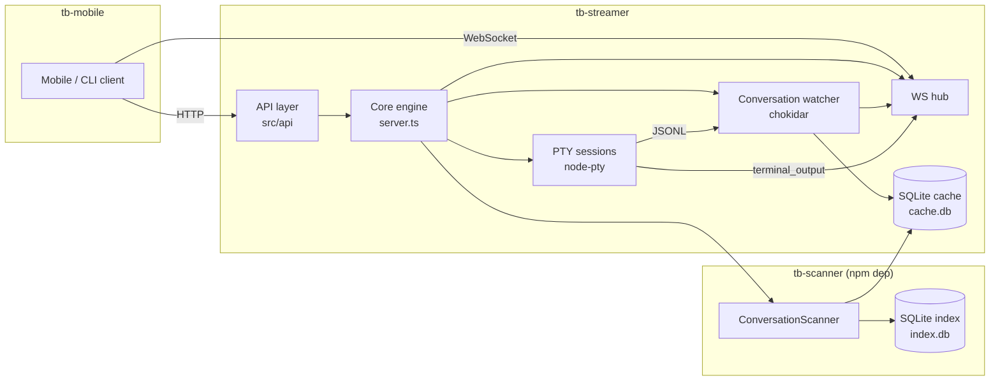

# @threadbase-sh/streamer

Runs and manages Claude Code sessions on a server: spawns them in a PTY, streams terminal output over WebSocket, and exposes a REST API for conversation history, search, and session control.

## Quick Start

### npm (recommended)

```bash
npm install -g @threadbase-sh/streamer
tb-streamer set-key <YOUR_API_KEY>   # one-time setup
tb-streamer serve
```

Only `node-pty` compiles on install; everything else ships prebuilt.

### Homebrew (macOS + Linux)

```bash
brew tap RonenMars/threadbase
brew install tb-streamer
tb-streamer set-key <YOUR_API_KEY>   # one-time setup
brew services start tb-streamer      # also starts on login
```

Stop/restart with `brew services stop|restart tb-streamer`. Mutually exclusive with the manual `scripts/deploy.sh` install — if switching from that, run `launchctl bootout gui/$UID/com.threadbase.streamer` first.

### Build locally

```bash
npm install
npm run build
node dist/cli.cjs serve --verbose --local-no-auth
```

#### Server address

The server listens on `http://localhost:8766` (WebSocket at `ws://localhost:8766/ws`).

#### Automatic updates

npm and Homebrew installs can auto-update: [docs/guides/auto-update.md](docs/guides/auto-update.md).

## Remote Access

The server only binds to `127.0.0.1:8766` by default. To let the mobile app reach it from outside your LAN, expose it via a tunnel — the fastest is a Cloudflare quick-tunnel (no account needed):

```bash
bash scripts/remote-access/cloudflare.sh      # macOS/Linux/WSL/Git Bash
pwsh scripts/remote-access/cloudflare.ps1     # anywhere pwsh is installed
```

Other providers and full setup: [docs/guides/remote-access](docs/guides/remote-access/README.md).

## Development

```bash
npm test                  # run tests
npm run lint              # type-check + lint
npm run format            # auto-format
npm run build             # build ESM/CJS + copy migrations
npm run dev               # watch mode
npm run migrate           # apply SQLite migrations
npm run db:validate       # check for missing/duplicate/orphaned project_id data
```

## Persistence

Conversation metadata is cached in SQLite at `~/.threadbase/cache/cache.db`, created and migrated automatically — no setup needed. Sessions are in-memory: a restart drops live PTYs, but history is on disk and any session can be resumed with `POST /api/sessions/resume`.

PostgreSQL is optional and only stores upload records today. Enable it by setting `THREADBASE_DATABASE_URL`; migrations run automatically.

## Architecture



Three layers: **core engine** (`src/*.ts`) → **API layer** (`src/api/` + `src/index.ts`) → **CLI** (`cli/`).

- `POST /api/sessions/start` / `resume` spawns `claude` in a PTY; output streams to WebSocket clients as `terminal_output`, with a `terminal_replay` snapshot on subscribe.
- `SessionStore` tracks both PTY-managed sessions and externally-running `claude` processes discovered on disk.
- A chokidar-backed watcher tails conversation JSONL files into the SQLite cache, so list/search endpoints don't scan the filesystem.
- When the last WebSocket subscriber disconnects, a grace timer (default 4.5 min) puts the PTY on hold — history stays intact and it's resumable anytime.

More detail: [docs/how-it-works.md](docs/how-it-works.md) and [docs/architecture/](docs/architecture/README.md).

## REST API

Full endpoint reference: [docs/api-reference.md](docs/api-reference.md).

## Mobile Pairing (QR)

A pairing QR is printed on server start (skip with `--no-pair-qr`), or reprint one anytime with `tb-streamer pair`. Scanning it trades a single-use token for a sealed API key — the key itself never appears in the QR.

If the phone can't reach `localhost`, give it a reachable address via (in order of precedence) `--public-url`, `THREADBASE_PUBLIC_URL`, or `public_url:` in `server.yaml`. HTTPS is required except for `localhost`.

## Global CLI Commands

Deploying installs two equivalent global commands wrapping `~/.threadbase/cli.js`: `tb-streamer` and `threadbase-streamer`. Details: [docs/guides/deploy-internals.md](docs/guides/deploy-internals.md).
