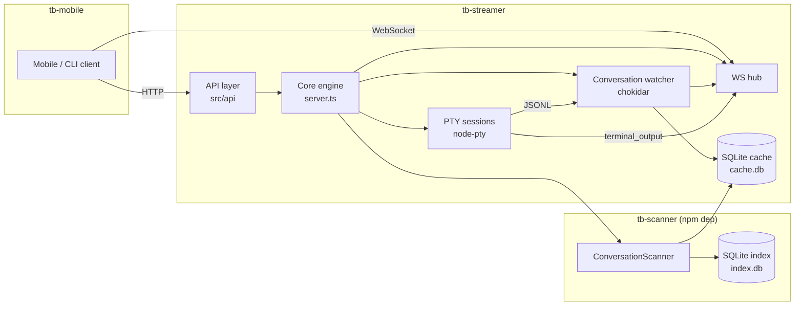

# @threadbase-sh/streamer

Runs and manages Claude Code sessions on a server: spawns them in a PTY, streams terminal output over WebSocket, and exposes a REST API for conversation history, search, and session control.

## Quick Start

### npm (recommended)

```bash
npm install -g @threadbase-sh/streamer
tb-streamer set-key <YOUR_API_KEY>   # one-time setup
tb-streamer serve
```

Only `node-pty` compiles on install; everything else ships prebuilt.

### Homebrew (macOS + Linux)

```bash
brew tap RonenMars/threadbase
brew install tb-streamer
tb-streamer set-key <YOUR_API_KEY>   # one-time setup
brew services start tb-streamer      # also starts on login
```

Stop/restart with `brew services stop|restart tb-streamer`. Mutually exclusive with the manual `scripts/deploy.sh` install — if switching from that, run `launchctl bootout gui/$UID/com.threadbase.streamer` first.

### Build locally

```bash
npm install
npm run build
node dist/cli.cjs serve --verbose --local-no-auth
```

#### Server address

By default, the server listens on port `8766` on all interfaces (WebSocket path: `/ws`).

#### Automatic updates

npm and Homebrew installs can auto-update: [docs/guides/auto-update.md](docs/guides/auto-update.md).

## Remote Access

The server listens on port 8766 on all interfaces by default, so devices on the same LAN can already reach it. To restrict it to this machine, start it with `tb-streamer serve --host 127.0.0.1`. To let the mobile app reach it from *outside* your LAN, expose it via a tunnel — the fastest is a Cloudflare quick-tunnel (no account needed):

> **Before you do this, read [Security](#security--read-this-before-exposing-the-server).** A tunnel makes the server reachable from the public internet, and the API key is the only thing between a stranger and a shell on this machine.

```bash
bash scripts/remote-access/cloudflare.sh      # macOS/Linux/WSL/Git Bash
pwsh scripts/remote-access/cloudflare.ps1     # anywhere pwsh is installed
```

Other providers and full setup: [docs/guides/remote-access](docs/guides/remote-access/README.md).

## Development

```bash
npm test                  # run tests
npm run lint              # type-check + lint
npm run format            # auto-format
npm run build             # build ESM/CJS + copy migrations
npm run dev               # watch mode
npm run migrate           # apply SQLite migrations
npm run db:validate       # check for missing/duplicate/orphaned project_id data
```

## Security — read this before exposing the server

**The API key is equivalent to a shell on this machine.** The streamer exists to start Claude Code sessions and type into them, so anyone holding the key can run commands as your user, in any project the server can reach. Treat it like an SSH private key, not like a web session token.

The key lives at `~/.threadbase/server.yaml` as plaintext (`chmod 0600`), which is the same posture as `~/.aws/credentials` or `~/.npmrc`. Rotate it with `POST /api/auth/rotate` if it leaks; re-pair your devices afterwards.

**The server listens on all network interfaces by default**, not just loopback. So every device on your LAN can already reach port 8766, and the API key is the only thing stopping them. On a home network that is usually fine; on café Wi-Fi, a co-working space, or a corporate VLAN it is not. To bind only to loopback, run:

```bash
tb-streamer serve --host 127.0.0.1
```

**A tunnel extends that to the entire internet.** From that moment the key is the only thing between a stranger and your filesystem.

For stricter network policies, also use your firewall or a network namespace.

### There is no spend limit

Nothing in this server caps what a session costs. There is no per-session, per-day, or total ceiling, and no way to configure one — a runaway agent bills your provider account until you stop it. (`--max-budget-usd` is not a workaround: it only applies to `claude --print`, which this server never uses, so it was silently inert and has been removed.)

The practical bound is that a session waits for input between turns. Auto-resume and bypass modes both weaken that bound — see below.

### Permission modes decide how much a session can do unattended

Sessions spawn with `--permission-mode`, default `acceptEdits`: file edits are auto-approved, shell commands still prompt. The first-run prompt offers only `acceptEdits` and `manual`, so the unattended modes are never something you pick by accident.

`bypassPermissions` and `dontAsk` are available through `--default-permission-mode` and `PUT /api/config/claude-flags`, and they remove the confirmation step entirely. **A session in either mode is unattended arbitrary code execution**: a leaked key no longer stops at a human-in-the-loop prompt. `--add-dir` compounds this by widening filesystem scope beyond the project.

If you enable one, you are accepting that the auth boundary is the *only* remaining control. Two guardrails exist and neither is a substitute for that judgement: `PUT /api/config/claude-flags` is refused with 403 while `--local-no-auth` is active, and every flag change is logged with its old and new value.

### Auto-resume starts agents without you

`auto_resume_on_boot` in `server.yaml` re-starts sessions that a previous run was interrupted mid-flight. It defaults to `false` and is never enabled implicitly — it is the one setting that lets the streamer start an agent nobody asked for in that moment, and combined with a bypass permission mode that is unattended code execution after a reboot.

Leave it off unless you have a reason, and do not combine it with a bypass mode unless you fully trust everything that can reach the API.

### Reporting a vulnerability

See [SECURITY.md](https://github.com/RonenMars/threadbase/blob/main/SECURITY.md) in the umbrella repo.

## Persistence

Conversation metadata is cached in SQLite at `~/.threadbase/cache/cache.db`, created and migrated automatically — no setup needed.

Live PTYs do not survive a restart, but sessions are not lost: the managed-session registry (`~/.threadbase/runtime.db`) brings interrupted sessions back in `GET /api/sessions` as resumable stubs, and any conversation can be resumed with `POST /api/sessions/resume`. History itself is always on disk, written by the provider.

PostgreSQL is optional and only stores upload records today. Enable it by setting `THREADBASE_DATABASE_URL`; migrations run automatically.

## Architecture


```mermaid
graph LR
    subgraph Mobile["tb-mobile"]
        Client[Mobile / CLI client]
    end

    subgraph Streamer["tb-streamer"]
        API[API layer<br/>src/api]
        Core[Core engine<br/>server.ts]
        WSHub[WS hub]
        PTY[PTY sessions<br/>node-pty]
        Watcher[Conversation watcher<br/>chokidar]
        Cache[(SQLite cache<br/>cache.db)]
    end

    subgraph ScannerPkg["tb-scanner (npm dep)"]
        Scanner[ConversationScanner]
        SCache[(SQLite index<br/>index.db)]
    end

    Client -- HTTP --> API
    Client -- WebSocket --> WSHub
    API --> Core
    Core --> WSHub
    Core --> PTY
    Core --> Watcher
    Core --> Scanner
    Watcher --> Cache
    Watcher --> WSHub
    PTY -- JSONL --> Watcher
    PTY -- terminal_output --> WSHub
    Scanner --> SCache
    Scanner --> Cache
```

Three layers: **core engine** (`src/*.ts`) → **API layer** (`src/api/` + `src/index.ts`) → **CLI** (`cli/`).

- `POST /api/sessions/start` / `resume` spawns `claude` in a PTY; output streams to WebSocket clients as `terminal_output`, with a `terminal_replay` snapshot on subscribe.
- `SessionStore` tracks both PTY-managed sessions and externally-running `claude` processes discovered on disk.
- A chokidar-backed watcher tails conversation JSONL files into the SQLite cache, so list/search endpoints don't scan the filesystem.
- A WebSocket subscriber disconnecting never stops the agent — sessions outlive a sleeping phone or a dropped connection. A PTY is put on hold (history intact, resumable anytime) only on an explicit `hold_session` message, or by the idle reaper after 6 h of agent silence.

More detail: [docs/how-it-works.md](docs/how-it-works.md) and [docs/architecture/](docs/architecture/README.md).

## Feature flags

Streamer experiments are the `FEATURE_FLAGS` object in `src/feature-flags.ts`, keyed by name (`ptyHost`, `liveActivityPush`, …). `--feature <id=bool>` and `feature_flags:` in `server.yaml` use **those same camelCase keys**. Env vars are a different spelling (`THREADBASE_FEATURE_PTY_HOST`) and outrank both.

Unknown yaml keys (typos, snake_case, the env name) are dropped with a warning; they do not stop the boot. Flags resolve once at boot — a change needs a restart. List and provenance: `GET /api/config/feature-flags`.

Operator detail: [docs/guides/feature-flags.md](docs/guides/feature-flags.md). Implementation: `CLAUDE.md` § Feature flags.

## REST API

Full endpoint reference: [docs/api-reference.md](docs/api-reference.md).

## Mobile Pairing (QR)

A pairing QR is printed on server start (skip with `--no-pair-qr`), or reprint one anytime with `tb-streamer pair`. Scanning it trades a single-use token for a sealed API key — the key itself never appears in the QR.

If the phone can't reach `localhost`, give it a reachable address via (in order of precedence) `--public-url`, `THREADBASE_PUBLIC_URL`, or `public_url:` in `server.yaml`. HTTPS is required except for `localhost`.

## Global CLI Commands

Deploying installs two equivalent global commands wrapping `~/.threadbase/cli.js`: `tb-streamer` and `threadbase-streamer`. Details: [docs/guides/deploy-internals.md](docs/guides/deploy-internals.md).
